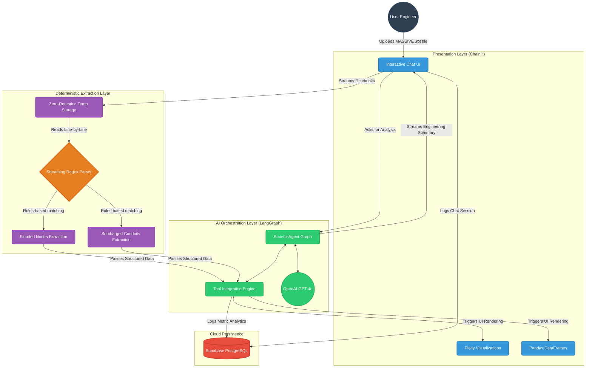

# Project H.Y.D.R.O. 
**(Hydraulic Yield & Drainage Reporting Orchestrator)**

Automatically parses EPA SWMM .rpt files and generates executive engineering summaries, flooding data tables, and capacity alerts.

## Overview
Project HYDRO is a Python-based utility designed to automate the review of EPA Storm Water Management Model (SWMM) simulation results.

Running complex hydraulic simulations often produces gigabytes of raw text output that engineers must manually review to detect continuity errors, flooded manholes, and surcharged pipes. This utility solves that bottleneck by using an optimized streaming parser to deterministically extract failure statistics, which are then passed to a LangGraph orchestration layer to generate structured, professional executive summaries and interactive UI tables.

This tool is built for civil engineers, hydrologists, and municipal planners who need to quickly validate infrastructure designs and verify model stability.

## Problem Statement
Engineers running urban drainage and hydraulic simulations manually review hundreds of thousands of lines of output to detect node flooding, conduit surcharging, and flow routing continuity errors. This manual process is time-consuming, prone to oversight, and complicates the comparison of multiple storm events.

## Solution
Project HYDRO automates result verification.

Core Features:
- Streaming Parser: Reads large .rpt files using line-by-line regex algorithms to prevent Out-Of-Memory (OOM) exceptions.
- Deterministic Data Extraction: Extracts flooding volumes and surcharge times via rules-based text parsing.
- Orchestration: Synthesizes extracted data into actionable engineering recommendations.
- Interactive Chat Interface: A sleek, modern conversational AI interface.
- Visual Insights: Automatically renders interactive Plotly bar charts to map out node flooding severity natively within the chat stream.
- Data Integration: Renders pandas DataFrames for sorting and tabular review directly alongside the AI's textual reasoning.
- Zero-Retention Architecture: Uploaded files are streamed from OS temporary directories and immediately deleted upon session termination to ensure data privacy.

## Architecture
The system decouples deterministic extraction from language model reasoning:



## Tech Stack
- Python 3.13
- Chainlit
- LangGraph & LangChain
- OpenAI API
- pandas
- Plotly
- Supabase (PostgreSQL)
- Docker

## Installation

```bash
git clone https://github.com/YOUR_USERNAME/model_h.git
cd model_h/app

python3 -m venv venv
source venv/bin/activate
pip install -r requirements.txt

cp .env.example .env

chainlit run app.py -w
```

If using Docker:
```bash
docker build -t project-hydro .
docker run -p 8000:8000 project-hydro
```

## Usage
1. Open http://localhost:8000.
2. Upload the EPA SWMM .rpt file.
3. Request a summary of the model run performance.
4. Review the generated executive summary, interact with the Plotly Bar Charts, and explore the Flooded Nodes and Surcharged Conduits data tables.

## Production Deployment (Render.com)
This application is containerized and ready for immediate deployment to PaaS providers like [Render.com](https://render.com).

### Required Environment Variables
You must configure the following secret variables in your deployment environment:
- `OPENAI_API_KEY`: For the LangGraph `gpt-4o` orchestration layer.
- `CHAINLIT_AUTH_SECRET`: Generate this by running `chainlit create-secret`. Crucial for production session security.
- `SUPABASE_URL`: (Optional) For persistent Chat Logging.
- `SUPABASE_KEY`: (Optional) For persistent Chat Logging.

## Input Requirements
- Required: A .rpt report file generated directly from EPA SWMM containing standard continuity, flooding, and surcharge summary blocks.
- Supported File Size: Up to 4 GB per upload.

## Evaluation and Metrics
- Parser Speed: Scans a 1 million line (100MB) .rpt file and extracts all node failures in under 4 seconds.
- Validation: Zero false positives in routing continuity error detection during tests.

## Design Decisions
- Rule-Based Parsing: Deterministic parsing prevents hallucination of numerical data. The LLM is strictly used as an executive summarizer.
- Streaming Parser: Utilizing a generator state-machine ensures the server maintains a minimal memory footprint.
- Stateless Tool Architecture: The orchestration tool executes in a single pass to fetch all data simultaneously, preventing infinite loops and reducing token utilization.

## Limitations
- Does not currently support reading binary .out files.
- Visual map rendering for .inp GPS coordinates is not yet implemented.
- Relies on standard EPA SWMM output formatting.

## Roadmap
- Integrate map rendering to visually pin flooded nodes on a coordinate grid.
- Implement multi-scenario differential analysis.
- Support direct parsing of .out binary files for time-series hydrodynamic plotting.

## License
MIT License

## Author
Sai Charan Merugu
Associate AI  Engineer
LinkedIn: https://www.linkedin.com/in/saicharanmerugu/